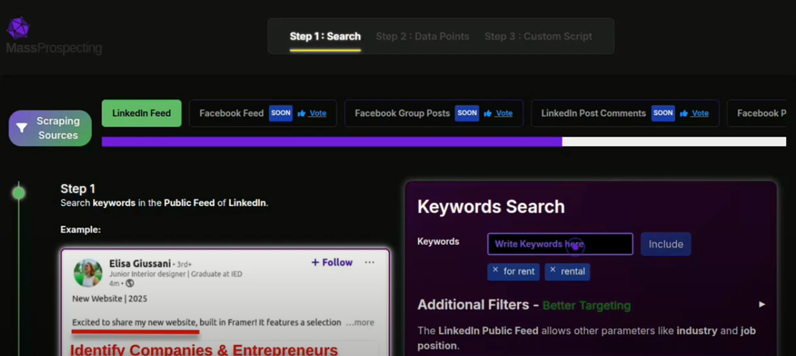
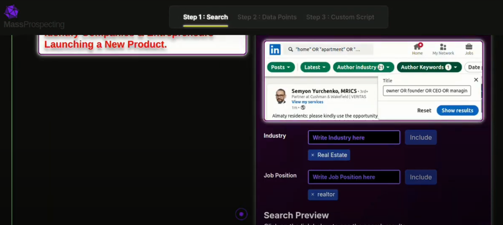
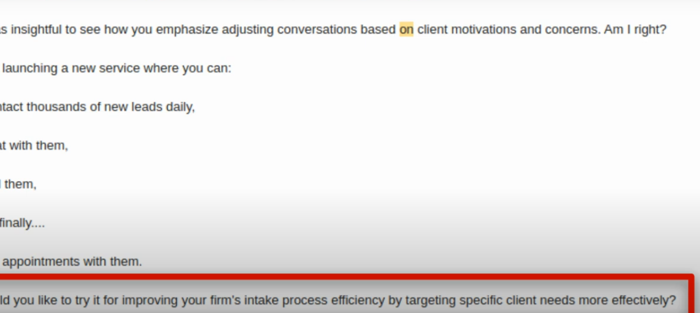
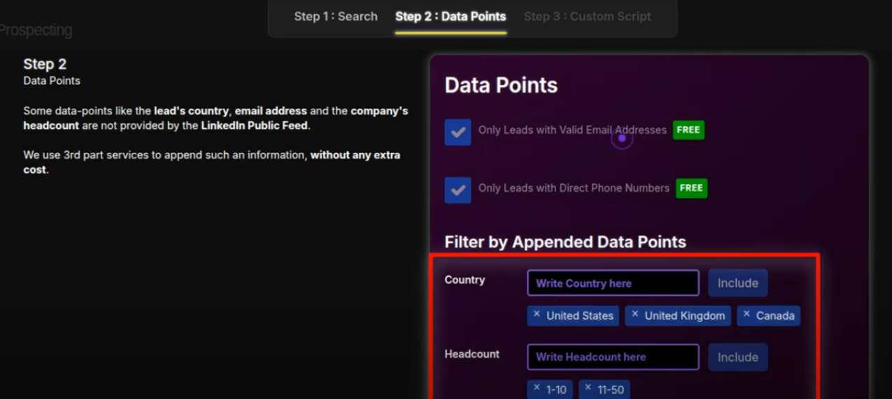
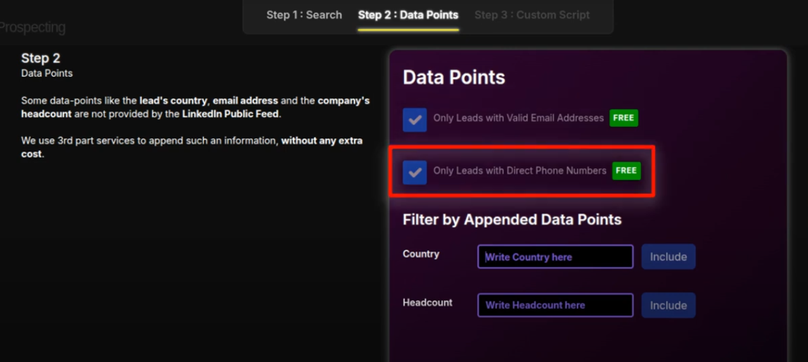
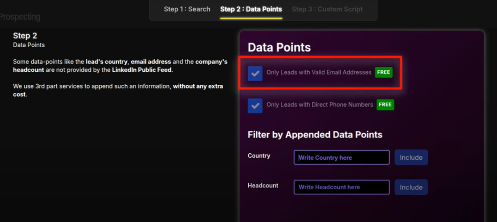
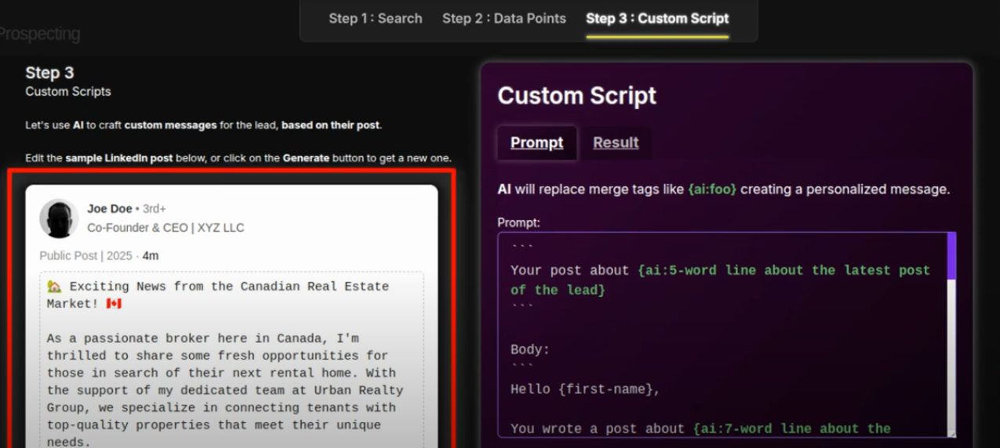
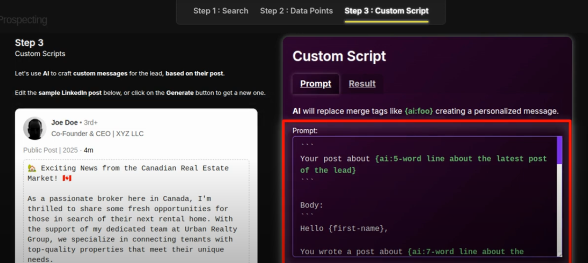

# Placing a Scraping Order

Welcome to MassProspecting! This guide will help you place your first scraping order in just a few minutes.

📺 [Watch the demo video](https://youtu.be/UzBZdIxyHB0)

---

## Overview

In MassProspecting, scraping orders allow you to automate lead generation by specifying the type of people and posts you want to target on LinkedIn.

Placing an order involves 3 steps:

---

## Step 1 – Search for Relevant Posts

Start by entering keywords your ideal leads might post about.

For example: “for rent”, “launching a product”, “funding”, “hiring”.

You can also filter by job title and industry to better target the authors of those posts.

This lets you find posts like:

---

## Step 2 – Enrich with Data Points

MassProspecting appends extra information to each lead, such as:

- Valid Email Address ✅
- Direct Phone Number ✅
- Country & Company Headcount

And it’s completely free.

You can refine your leads with additional filters like country or company size:

---

## Step 3 – Generate a Personalized Script

Using AI, MassProspecting creates a message for each lead based on their actual post.

You can edit the script template before launching.

Preview the original post and the AI-generated message side by side:

---

## Launch Your Order

Once your filters and message are ready, hit "Place Order".

You can monitor it under the Orders tab.

🎯 You’re now scraping fresh leads in real time!

