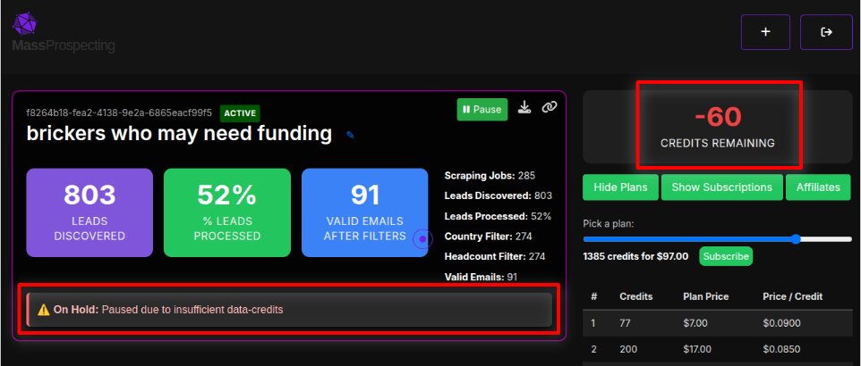
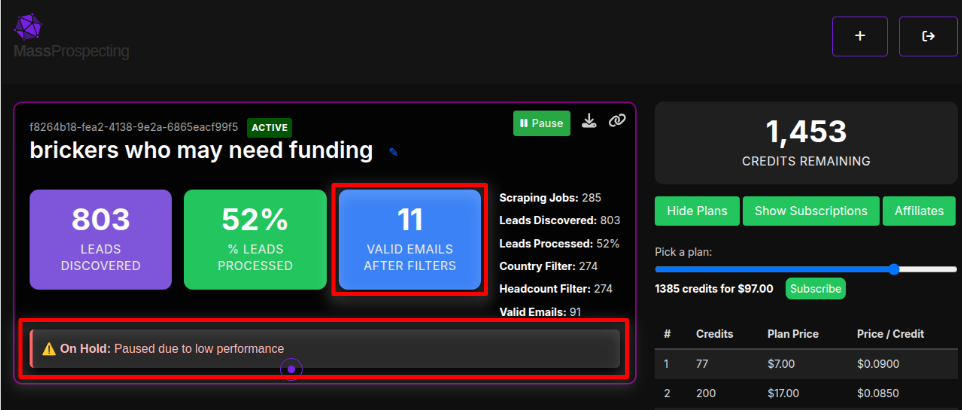

# Alerts

Sometimes, a scraping order may be automatically paused and placed “On Hold.”

There are two possible reasons for this:

---

## 1. ⚠️ Insufficient Credits

If your account runs out of data-credits, your scraping order will be paused until you recharge.

In this case:

- The alert reads: “On Hold: Paused due to insufficient data-credits”
- The “Credits Remaining” counter will show a negative number
- You’ll need to purchase more credits to resume processing

🟢 Once you top up your credits, the order will automatically resume.

---

## 2. ⚠️ Low Performance

If the system detects your filters are yielding very few valid leads (e.g. valid emails), the order will be paused and you have to create a better performing order.

This may happen when:

- You’re targeting a niche audience that rarely posts
- Your filters are too restrictive
- Your keywords don’t match recent posts

To fix this:

- Edit your order to use broader filters
- Use more common keywords
- Expand your country or headcount filters

Once improved, the system will automatically restart your order when performance improves.

---

If you're unsure how to fix a paused order, feel free to [contact support](https://wa.me/5491150612148?text=Hello!%20I%27m%20interested%20in%20MassProspecting!.) — we're here to help!
